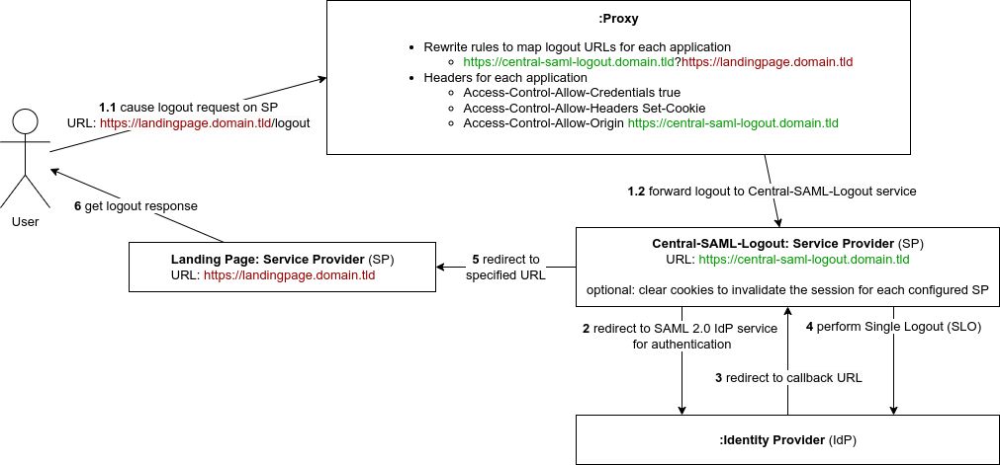

= central-saml-logout

This project is a dedicated service that allows to perform Single Logout (SLO) actions.

Many web applications nowadays support SAML 2.0, but there is a lack of support for the SLO mechanism, which causes additional costs for plugins with proprietary licenses.
In order to reduce costs a dedicated logout service can be used to perform logout actions for all applications instead of using the SLO mechanism for each application.

This solution is intended to be used with a proxy to specify URL https://en.wikipedia.org/wiki/Rewrite_engine[rewrite rules] to internally rewrite requests directed to a logout URL of a https://en.wikipedia.org/wiki/Service_provider_(SAML)[service provider (SP)] to the dedicated service, which can handle the logout instead.

.The Use case explained via communication diagram

== What is Single Logout (SLO)

When a user initiates a logout, the SAML 2.0 https://en.wikipedia.org/wiki/Identity_provider[identity provider (IdP)] performs a logout for all service providers in the current session of the identity provider.

== Usage

To pass arguments to the application there are three options available.

* create a _.env_ file to specify the environment variables
* set the environment variables directly
* use command line parameters

[cols="7,7,15,1",options="header"]
|===

|command line parameter
|environment variable
|description
|required

|`&#8209;n` +
`&#8209;&#8209;server&#8209;hostname`
|`SERVER_HOSTNAME`
|The server hostname. (default: "localhost", default for use inside a docker container: "0.0.0.0")
|no

|`&#8209;p` +
`&#8209;&#8209;server&#8209;port`
|`SERVER_PORT`
|The server port. (default: "8090")
|no

|`&#8209;b` +
`&#8209;&#8209;base&#8209;url`
|`BASE_URL`
|The frontend base URL (default: "http://localhost:8090")
|no

|`&#8209;m` +
`&#8209;&#8209;idp&#8209;metadata`
|`IDP_METADATA`
|A local file path or URL directed to the IdP metadata.
|yes

|`&#8209;i` +
`&#8209;&#8209;issuer`
|`ISSUER`
|The SAML issuer. (default: the callback URL)
|no

|`&#8209;c` +
`&#8209;&#8209;cookies&#8209;to&#8209;clear`
|`COOKIES_TO_CLEAR`
|An optional list of cookies that are cleared on logout for all service providers to end the running sessions directly. See the topic session invalidation below.
|no

|`&#8209;l` +
`&#8209;&#8209;fallback&#8209;logout&#8209;url`
|`FALLBACK_LOGOUT_URL`
|Do only specify if needed. The fallback URL if no URL is specified in the query string of the logout call.
|no

|`&#8209;s` +
`&#8209;&#8209;login&#8209;success&#8209;url`
|`LOGIN_SUCCESS_URL`
|Do only specify if needed. An alternative page to signal login success.
|no

|`&#8209;f` +
`&#8209;&#8209;login&#8209;failure&#8209;url`
|`LOGIN_FAILURE_URL`
|Do only specify if needed. An alternative page to signal login failure.
|no

|`&#8209;h` +
`&#8209;&#8209;help`
|
|Shows a detailed help text and ignores other arguments.
|

|`&#8209;V` +
`&#8209;&#8209;version`
|
|Shows the tool version and ignores other arguments.
|

|===

=== Session invalidation

The SLO mechanism allows to end the identity provider session, but the sessions of the service providers remain active.
If this is a problem, there are two strategies to handle it.

1. The session of each service provider is short-lived by a restrictive timeout.
2. The central-saml-logout service allows to invalidate the session for each application of the whole platform by specifying a list of cookies that will be cleared on the logout action.

NOTE: In modern browsers cross-site scripting (XSS) only works via HTTPS and only with the cookie attributes "SameSite=None" and "Secure".
This is done by enabling cross-site scripting.
See example below.

.Notation for cookies to clear
[source,json]
----
[
  {
    "domain": "sp1.domain.tld",
    "name": "MY_SESSION_ID",
    "xss": true
  },
  {
    "domain": "domain.tld",
    "path": "/sp2",
    "name": "MY_SESSION_ID",
    "xss": false
  }
]
----

=== Proxy configuration

The proxy needs to be configured with a redirection to pass logout actions of a service provider to the central-saml-logout service.
In order to allow the central-saml-logout service to clear the running session of a service provider, additional headers that enable XSS must be specified.

.Example configuration for Nginx
[source]
----
server {

...

    add_header Access-Control-Allow-Credentials true;
    add_header Access-Control-Allow-Headers Set-Cookie;
    add_header Access-Control-Allow-Origin https://central-saml-logout.domain.tld;

    location ~ ^/sp1/logout$ {
         return 302 https://central-saml-logout.domain.tld/logout?http://localhost:8080/sp1/status;
    }

...

}
----

.Example configuration for Apache2 HTTP Server
[source]
----
<VirtualHost *:8080>

...

    Header set Access-Control-Allow-Credentials "true"
    Header set Access-Control-Allow-Headers "Set-Cookie"
    Header set Access-Control-Allow-Origin "http://localhost:8181"

    RewriteRule ^/sp1/logout$ "https://central-saml-logout.domain.tld/logout?http://localhost:8080/sp1/status" [R=302,L]

...

</VirtualHost>
----

== License

Copyright (c) 2022 ASERVO Software GmbH

Licensed under the Apache License, Version 2.0 (the "License"); you may not use this file except in compliance with the License.
You may obtain a copy of the License at

_http://www.apache.org/licenses/LICENSE-2.0_

Unless required by applicable law or agreed to in writing, software distributed under the License is distributed on an "AS IS" BASIS, WITHOUT WARRANTIES OR CONDITIONS OF ANY KIND, either express or implied.
See the License for the specific language governing permissions and limitations under the License.
